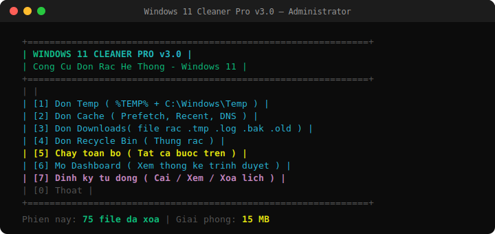
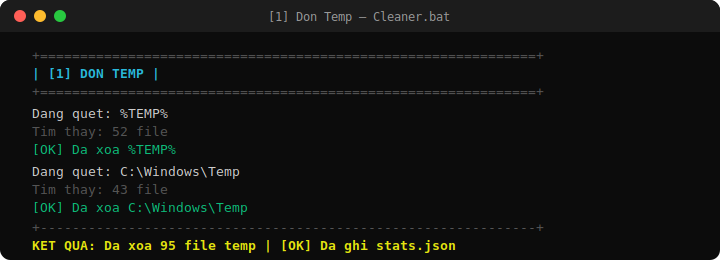
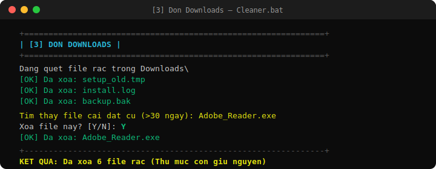
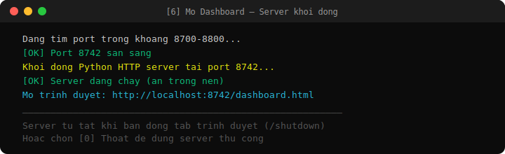
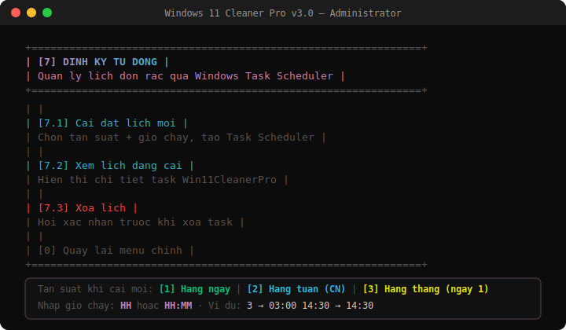
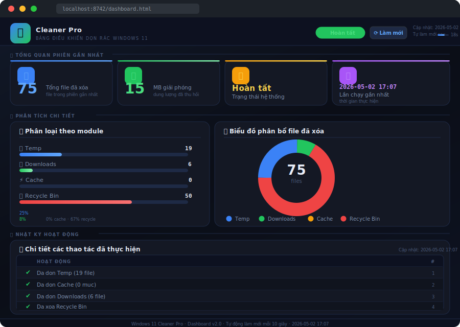

# 🧹 Windows 11 Cleaner Pro — v3.0

> Công cụ dọn rác hệ thống Windows viết bằng **Batch Script**, kèm **Dashboard HTML** trực quan hiển thị thống kê sau mỗi lần dọn và hỗ trợ **lên lịch tự động** qua Windows Task Scheduler.


---

## 📦 Nội dung bộ cài

```
pro-cleaner/
├── Cleaner.bat       ← Script chính, chạy file này
├── dashboard.html    ← Giao diện dashboard (mở qua Cleaner.bat)
├── stats.json        ← Dữ liệu thống kê (tự tạo/cập nhật sau mỗi lần dọn)
├── README.md         ← Tài liệu này
└── images/           ← Ảnh minh họa cho README
```

---

## ✅ Yêu cầu hệ thống

| Thành phần | Yêu cầu | Ghi chú |
|---|---|---|
| Hệ điều hành | Windows 10 / 11 | 64-bit khuyến nghị |
| Quyền chạy | **Administrator** | Bắt buộc để xóa `C:\Windows\Temp`, Prefetch và tạo Scheduled Task |
| Python | 3.6 trở lên | Để khởi động HTTP server cho Dashboard |
| PowerShell | Có sẵn trên Windows | Ghi `stats.json`, dọn Recycle Bin, tạo/query Scheduled Task |
| Trình duyệt | Chrome / Edge / Firefox | Xem Dashboard |

> **Tải Python:** https://www.python.org/downloads/  
> Khi cài, nhớ tick **"Add Python to PATH"**

---

## 🚀 Cách sử dụng

1. Chuột phải vào `Cleaner.bat` → **Run as administrator**
2. Chọn chức năng từ menu bằng cách nhập số `(0–7)`
3. Sau khi dọn xong, chọn `[6]` để mở Dashboard xem thống kê
4. Nhấn `[0]` để thoát

> ⚠️ **Quan trọng:** Không double-click trực tiếp vào `dashboard.html` — trình duyệt sẽ chặn tải `stats.json` do bảo mật `file://`. Luôn mở Dashboard qua menu `[6]`.

---

## 🖥️ Menu chính



```
+==============================================================+
|  WINDOWS 11 CLEANER PRO  v3.0                              |
|  Cong Cu Don Rac He Thong - Windows 11                     |
+==============================================================+
|   [1]  Don Temp     ( %TEMP% + C:\Windows\Temp )           |
|   [2]  Don Cache    ( Prefetch, Recent, DNS )              |
|   [3]  Don Downloads( file rac .tmp .log .bak .old )       |
|   [4]  Don Recycle Bin ( Thung rac )                       |
|   [5]  Chay toan bo ( Tat ca buoc tren )                   |
|   [6]  Mo Dashboard ( Xem thong ke trinh duyet )           |
|   [7]  Dinh ky tu dong ( Cai / Xem / Xoa lich )           |
|   [0]  Thoat                                               |
+==============================================================+
```

---

## 🗂️ Chi tiết từng chức năng

### \[1\] Dọn Temp



- Xóa toàn bộ file trong `%TEMP%` (thư mục temp của người dùng)
- Xóa file trong `C:\Windows\Temp`
- Tự tạo lại thư mục sau khi xóa để Windows không bị lỗi
- Ghi kết quả vào `stats.json` sau khi hoàn tất

### \[2\] Dọn Cache

- Xóa file `*.pf` trong `C:\Windows\Prefetch`
- Xóa Recent files: `%APPDATA%\Microsoft\Windows\Recent`
- Flush DNS cache bằng lệnh `ipconfig /flushdns`

### \[3\] Dọn Downloads



- **Giữ nguyên** cấu trúc thư mục con trong `Downloads`
- Xóa toàn bộ nội dung bên trong từng thư mục con (đệ quy)
- Xóa file rác ở thư mục gốc: `.tmp`, `.log`, `.bak`, `.old`
- Hỏi xác nhận trước khi thực hiện

### \[4\] Dọn Recycle Bin

- Hỏi xác nhận trước khi xóa
- Dùng PowerShell `Clear-RecycleBin` để dọn sạch toàn bộ thùng rác

### \[5\] Chạy toàn bộ

Thực hiện tuần tự **Temp → Cache → Downloads → Recycle Bin** sau một lần xác nhận duy nhất. Sau khi hoàn tất hiển thị tổng kết và hỏi có mở Dashboard không.

### \[6\] Mở Dashboard



- Kiểm tra Python có trong PATH không
- Khởi động PowerShell mở cửa sổ riêng chạy `python -m http.server 8000 --bind 127.0.0.1`
- Chờ tối đa 8 giây cho server sẵn sàng (poll TCP port 8000)
- Tự động mở trình duyệt tại `http://localhost:8000/dashboard.html`

> **Lưu ý:** Không đóng cửa sổ PowerShell đang chạy server trong khi xem Dashboard. Đóng cửa sổ đó để tắt server khi dùng xong.

### \[7\] Định kỳ tự động



Quản lý lịch dọn rác tự động qua **Windows Task Scheduler**. Gồm 3 sub-menu:

#### \[7.1\] Cài đặt lịch mới

Luồng cài đặt gồm 3 bước:

**Bước 1 — Chọn tần suất:**
```
[1]  Hằng ngày
[2]  Hằng tuần   ( Chủ Nhật )
[3]  Hằng tháng  ( ngày 1 )
```

**Bước 2 — Nhập giờ chạy:**
```
>> Nhập giờ (HH hoặc HH:MM): _
```
- Chấp nhận nhiều định dạng: `3` / `15` / `03:00` / `14:30` / `9:5`
- Chỉ nhập số giờ (không có dấu `:`): tự động thêm `:00` — ví dụ `15` → `15:00`
- Tự chuẩn hóa 2 chữ số: `3:5` → `03:05`
- Validate phạm vi: giờ `0–23`, phút `0–59`

**Bước 3 — Xác nhận và tạo task:**
- Tạo Scheduled Task tên `Win11CleanerPro` chạy với quyền `SYSTEM`
- Task gọi `Cleaner.bat AUTO` — chế độ tự động không cần tương tác
- Cập nhật ngay `stats.json` để Dashboard hiển thị trạng thái mới

#### \[7.2\] Xem lịch đang cài

Gọi `schtasks /query /tn "Win11CleanerPro"` và hiển thị chi tiết task đang chạy.

#### \[7.3\] Xóa lịch

Hỏi xác nhận trước khi xóa task `Win11CleanerPro`. Cập nhật `stats.json` sau khi xóa để Dashboard hiển thị "Chưa cài đặt".

---

## ⚙️ Chế độ AUTO (dành cho Scheduled Task)

Khi Task Scheduler gọi `Cleaner.bat AUTO`, script:
- Bỏ qua toàn bộ menu và xác nhận
- Tự động dọn Temp → Cache → Downloads → Recycle Bin
- Ghi kết quả vào `stats.json` (bao gồm `schedule_info`)
- Thoát im lặng — không mở Dashboard, không cần tương tác

---

## 📊 Dashboard



Dashboard đọc `stats.json` mỗi **10 giây** và hiển thị đầy đủ:

| Thành phần | Mô tả |
|---|---|
| **4 Stat Cards** | Tổng file xóa · MB giải phóng · Trạng thái · Lần chạy gần nhất |
| **Progress Bars** | Phân loại theo module: Temp / Downloads / Cache / Recycle Bin |
| **Biểu đồ Doughnut** | Chart.js hiển thị tỉ lệ phân bổ file theo danh mục |
| **Lịch tự động** | Trạng thái Scheduled Task: tên task · tần suất · lần chạy tiếp theo · lần chạy gần nhất |
| **Log Table** | Bảng nhật ký các thao tác đã thực hiện |
| **Auto-refresh** | Countdown bar + tự làm mới mỗi 10 giây |

> **Lịch tự động trên Dashboard** cập nhật ngay sau khi cài hoặc xóa lịch — không cần phải dọn rác trước.

---

## 📝 Cấu trúc file stats.json

Được ghi tự động bằng PowerShell (UTF-8, không BOM):

```json
{
  "files_deleted":  75,
  "space_saved_mb": 15,
  "last_run":       "2026-05-06 14:30",
  "status":         "Hoan tat",
  "temp":           19,
  "downloads":      6,
  "cache":          0,
  "recycle":        50,
  "schedule_info": {
    "enabled":    true,
    "frequency":  "Hang ngay luc 03:00",
    "next_run":   "2026-05-07 03:00",
    "last_auto":  "Chua chay lan nao"
  },
  "logs": [
    "Da don Temp (19 file)",
    "Da don Cache (0 muc)",
    "Da don Downloads (6 file)",
    "Da xoa Recycle Bin"
  ]
}
```

| Field | Kiểu | Mô tả |
|---|---|---|
| `files_deleted` | number | Tổng số file đã xóa trong phiên |
| `space_saved_mb` | number | Dung lượng ước tính giải phóng (MB) |
| `last_run` | string | Thời gian phiên dọn gần nhất |
| `status` | string | Trạng thái: `"Hoan tat"` |
| `temp / downloads / cache / recycle` | number | Số file/mục xóa theo từng danh mục |
| `schedule_info.enabled` | boolean | `true` nếu đang có task đang chạy |
| `schedule_info.frequency` | string | Mô tả tần suất và giờ chạy |
| `schedule_info.next_run` | string | Lần chạy tiếp theo (lấy từ Task Scheduler) |
| `schedule_info.last_auto` | string | Lần chạy tự động gần nhất |
| `logs` | array | Danh sách nhật ký — render vào bảng Dashboard |

---

## 🛠️ Tech Stack

| Thành phần | Vai trò |
|---|---|
| **Batch Script (.bat)** | Logic dọn dẹp, menu tương tác, đếm file, routing chế độ AUTO |
| **PowerShell** | Ghi `stats.json` (UTF-8 BOM-free), dọn Recycle Bin, tạo/query/xóa Scheduled Task |
| **Python `http.server`** | Serve `dashboard.html` + `stats.json` cục bộ tại `localhost:8000` |
| **Bootstrap 5.3** | Layout responsive, dark theme, utility classes |
| **Chart.js 4.4** | Biểu đồ Doughnut, animated scale, tooltip tùy chỉnh |
| **Be Vietnam Pro + Orbitron** | Font tiếng Việt đầy đủ dấu + font display cho số liệu |

---

## ⚠️ Lưu ý quan trọng

- Luôn chạy với quyền **Administrator** — bắt buộc để xóa `C:\Windows\Temp`, Prefetch và tạo Scheduled Task
- Dung lượng giải phóng hiển thị là **ước tính**, không phải số chính xác tuyệt đối
- File đang được chương trình khác sử dụng sẽ **không bị xóa** — Windows tự bảo vệ, script bỏ qua an toàn
- Thư mục con trong `Downloads` được **giữ nguyên** — chỉ nội dung bên trong bị xóa
- Scheduled Task chạy với quyền `SYSTEM` — hoạt động ngay cả khi chưa đăng nhập Windows

---

## 🔄 Lịch sử phiên bản

| Phiên bản | Thay đổi |
|---|---|
| **v3.0** | Thêm menu \[7\] Định kỳ tự động · Cài/xem/xóa Scheduled Task · Nhập giờ thủ công (hỗ trợ `15` → `15:00`) · Chế độ `AUTO` cho Task Scheduler · Dashboard hiển thị trạng thái lịch realtime |
| v2.5 | Python server qua PowerShell · Dọn Downloads giữ thư mục con · Font tiếng Việt UTF-8 đầy đủ |
| v2.0 | Thêm Python HTTP server · Ghi `stats.json` UTF-8 BOM-free |
| v1.0 | Script dọn rác cơ bản |

---

*Windows 11 Cleaner Pro — Made with ❤️ for Windows users*
